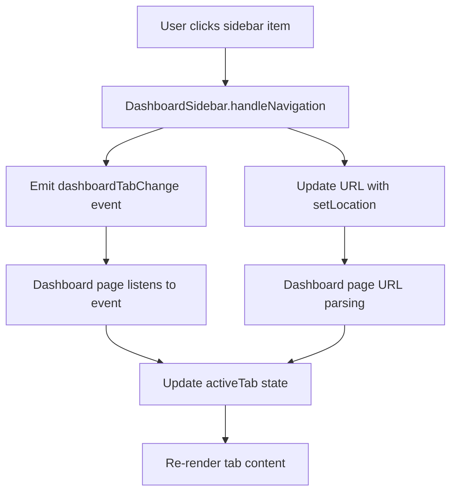

# Dashboard Navigation Guide

## Overview
This guide explains how the dashboard navigation system works in FinAutoJobs and how all tabs and components are properly linked.

## Navigation Architecture

### 1. **URL Structure**
```
/{role}-dashboard/{tab}/{subtab}?{params}

Examples:
- /applicant-dashboard                    → Dashboard overview
- /applicant-dashboard/profile           → Profile tab
- /applicant-dashboard/jobs              → Browse jobs tab
- /recruiter-dashboard/jobs/active       → Active jobs subtab
- /admin-dashboard/users                 → User management tab
```

### 2. **Navigation Flow**



## Component Structure

### 1. **DashboardSidebar.jsx**
- **Purpose**: Navigation menu with role-based items
- **Key Functions**:
  - `handleNavigation()`: Processes navigation clicks
  - `getNavigationItems()`: Returns role-specific menu items
  - Emits `dashboardTabChange` events for cross-component communication

### 2. **Dashboard Pages**
- **ApplicantDashboard.jsx**: Applicant-specific dashboard
- **RecruiterDashboard.jsx**: Recruiter-specific dashboard  
- **AdminDashboard.jsx**: Admin-specific dashboard

Each dashboard page:
- Listens for URL changes
- Handles `dashboardTabChange` events
- Manages `activeTab` state
- Renders appropriate tab content

### 3. **ModernDashboardLayout.jsx**
- **Purpose**: Common layout wrapper
- **Features**:
  - Responsive sidebar management
  - Header with breadcrumbs
  - Notification panel integration

## Navigation Features

### 1. **Role-Based Navigation**

#### **Applicant Dashboard Tabs**
- 📊 Dashboard (overview)
- 👤 Profile
- 💼 Browse Jobs
- ⭐ Recommended Jobs
- ❤️ Favorites
- 📄 Applications
- 🔔 Job Alerts
- 📈 Analytics
- ⚙️ Settings

#### **Recruiter Dashboard Tabs**
- 📊 Dashboard (overview)
- 👤 Profile
- 💼 Job Management
  - ➕ Post New Job
  - 🟢 Active Jobs
  - 📝 Draft Jobs
  - 🔒 Closed Jobs
- 👥 Applicant Management
- 🎯 Candidates
- 🗣️ Interviews
- 📈 Analytics
- 🔔 Notifications
- 💬 Messages
- 📋 Reports
- ⚙️ Settings

#### **Admin Dashboard Tabs**
- 📊 Dashboard (overview)
- 👤 Profile
- 👥 User Management
- 💼 Job Management
- 📈 System Analytics
- 🛡️ Content Moderation
- ⚙️ Settings

### 2. **URL Parameter Handling**

The system supports nested navigation:
```javascript
// Recruiter job management
/recruiter-dashboard/jobs/active    → Active jobs subtab
/recruiter-dashboard/jobs/draft     → Draft jobs subtab
/recruiter-dashboard/jobs/post      → Post new job subtab

// Admin user management
/admin-dashboard/users?tab=pending  → Pending users filter
```

### 3. **Event-Driven Navigation**

Custom events ensure synchronization:
```javascript
// Sidebar emits navigation events
const navigationEvent = new CustomEvent('dashboardTabChange', {
  detail: { tabId, jobTabId, userTab, path }
});
window.dispatchEvent(navigationEvent);

// Dashboard pages listen for events
window.addEventListener('dashboardTabChange', handleNavigationEvent);
```

## Implementation Details

### 1. **Sidebar Navigation Logic**
```javascript
const handleNavigation = (path, tabId, jobTabId, userTab) => {
  // Build correct URL path
  let fullPath;
  const dashboardPrefix = `/${userRole}-dashboard`;
  
  if (tabId === 'jobs' && jobTabId) {
    fullPath = `${dashboardPrefix}/${tabId}/${jobTabId}`;
  } else if (tabId) {
    fullPath = `${dashboardPrefix}/${tabId}`;
  }
  
  // Emit event for cross-component communication
  const navigationEvent = new CustomEvent('dashboardTabChange', {
    detail: { tabId, jobTabId, userTab, path: fullPath }
  });
  window.dispatchEvent(navigationEvent);
  
  // Update URL
  setLocation(fullPath);
};
```

### 2. **Dashboard URL Parsing**
```javascript
useEffect(() => {
  const pathParts = location.split("/");
  const validTabs = dashboardTabs.map(t => t.id);
  
  if (location === `/${userRole}-dashboard`) {
    setActiveTab("dashboard");
  } else if (pathParts.length >= 3) {
    const tab = pathParts[2];
    if (validTabs.includes(tab)) {
      setActiveTab(tab);
      
      // Handle subtabs for job management
      if (tab === 'jobs' && pathParts[3]) {
        setActiveJobTab(pathParts[3]);
      }
    }
  }
}, [location]);
```

### 3. **Event Listener Setup**
```javascript
useEffect(() => {
  const handleNavigationEvent = (event) => {
    const { tabId, jobTabId } = event.detail;
    
    if (tabId && validTabs.includes(tabId)) {
      setActiveTab(tabId);
      if (jobTabId) {
        setActiveJobTab(jobTabId);
      }
    }
  };
  
  window.addEventListener('dashboardTabChange', handleNavigationEvent);
  return () => window.removeEventListener('dashboardTabChange', handleNavigationEvent);
}, []);
```

## Testing Navigation

### 1. **Manual Testing Checklist**
- [ ] Click each sidebar item
- [ ] Verify URL updates correctly
- [ ] Check tab content renders
- [ ] Test browser back/forward buttons
- [ ] Verify deep linking works
- [ ] Test mobile sidebar behavior

### 2. **Navigation Test URLs**
```bash
# Applicant Dashboard
http://localhost:3000/applicant-dashboard
http://localhost:3000/applicant-dashboard/profile
http://localhost:3000/applicant-dashboard/jobs
http://localhost:3000/applicant-dashboard/applications

# Recruiter Dashboard
http://localhost:3000/recruiter-dashboard
http://localhost:3000/recruiter-dashboard/profile
http://localhost:3000/recruiter-dashboard/jobs/active
http://localhost:3000/recruiter-dashboard/jobs/post
http://localhost:3000/recruiter-dashboard/applicants

# Admin Dashboard
http://localhost:3000/admin-dashboard
http://localhost:3000/admin-dashboard/users
http://localhost:3000/admin-dashboard/jobs
http://localhost:3000/admin-dashboard/analytics
```

## Troubleshooting

### Common Issues

1. **Tab not updating on click**
   - Check if `handleNavigation` is called
   - Verify event emission and listening
   - Ensure valid tab IDs

2. **URL not matching tab content**
   - Check URL parsing logic
   - Verify `activeTab` state updates
   - Ensure `renderTabContent()` handles all cases

3. **Sidebar not highlighting active item**
   - Check `isPathActive()` function
   - Verify `current` property calculation
   - Ensure CSS classes are applied correctly

### Debug Console Logs

The system includes comprehensive logging:
```javascript
console.log('🔍 SIDEBAR NAVIGATION CALLED:', { path, tabId, jobTabId });
console.log('✅ Dashboard: Tab changed via event to:', tabId);
console.log('🔗 SIDEBAR NAVIGATING TO:', fullPath);
```

## Best Practices

1. **Always use `tabId` for navigation**
2. **Emit events for cross-component communication**
3. **Handle URL parsing robustly**
4. **Provide fallback for invalid routes**
5. **Test all navigation paths**
6. **Maintain consistent URL structure**

## Future Enhancements

1. **Breadcrumb navigation**
2. **Tab state persistence**
3. **Navigation history**
4. **Keyboard shortcuts**
5. **Progressive loading**
6. **Navigation analytics**
