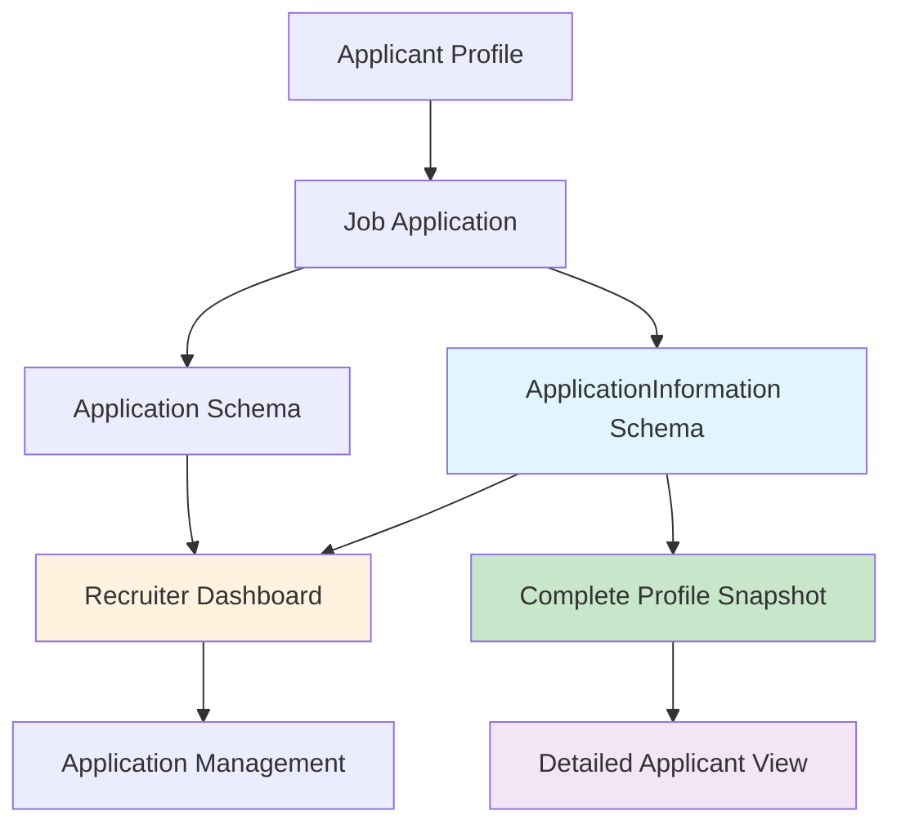

# Recruiter Dashboard Integration Guide

## 🎯 **Complete Application Flow Verified**

The system successfully implements the complete flow: **Applicant applies → ApplicationInformation captures all data → Appears in Recruiter Dashboard**

## 📊 **Flow Architecture**



## 🔄 **Data Flow Process**

### **Step 1: Applicant Applies for Job**
```javascript
// When applicant submits job application
POST /api/application-information
{
  "jobId": "job123",
  "applicationData": {
    "expectedSalary": { "rawSalaryText": "8-10 LPA" },
    "experience": { "totalYears": 3 },
    "coverLetter": "I am interested in this position...",
    "motivation": "Career growth opportunity"
  }
}
```

### **Step 2: System Creates Application + ApplicationInformation**
```javascript
// Creates Application record
Application {
  applicantId: "user123",
  jobId: "job123", 
  recruiterId: "recruiter456",
  applicationStatus: "pending"
}

// Creates ApplicationInformation with COMPLETE profile snapshot
ApplicationInformation {
  applicationId: "app789",
  applicantId: "user123",
  jobId: "job123",
  
  // Complete profile data captured at application time
  basicInfo: { firstName, lastName, email, phone, bio },
  expectedSalary: { salaryRange, rawText, displayText },
  experience: { totalYears, currentJob, workHistory },
  skills: { primary, technical, soft, languages },
  education: [{ institution, degree, grade }],
  socialLinks: { linkedin, github, portfolio },
  location: { current, preferences, relocation },
  jobPreferences: { types, industries, workArrangement },
  documents: { resume, coverLetter, portfolio },
  applicationDetails: { motivation, availability },
  profileSnapshot: { completionPercentage, qualityScore }
}
```

### **Step 3: Recruiter Dashboard Access**
```javascript
// Recruiter can access applications via multiple endpoints
GET /api/application-information/job/{jobId}  // All applications for specific job
GET /api/application-information/{appId}      // Detailed application info
GET /api/application-information/search       // Search with filters
```

## 🎯 **Recruiter Dashboard API Endpoints**

### **1. Get All Applications for Job**
```javascript
GET /api/application-information/job/68dcd39f4ddef10da1ee32d8

Response:
{
  "success": true,
  "data": {
    "job": {
      "id": "68dcd39f4ddef10da1ee32d8",
      "title": "Senior Financial Analyst",
      "companyName": "TechCorp Solutions"
    },
    "applications": [
      {
        "basicInfo": {
          "firstName": "John",
          "lastName": "Applicant", 
          "email": "john.applicant@example.com",
          "phone": "9876543210"
        },
        "expectedSalary": {
          "displayText": "₹8.0L - ₹10.0L yearly",
          "salaryRange": { "min": 800, "max": 1000 }
        },
        "experience": {
          "totalYears": 3,
          "rawExperienceText": "3 years",
          "currentJob": {
            "jobTitle": "Software Developer",
            "companyName": "Tech Solutions"
          }
        },
        "skills": {
          "primary": [
            { "skill": "JavaScript", "proficiency": "intermediate" },
            { "skill": "React", "proficiency": "intermediate" },
            { "skill": "Node.js", "proficiency": "intermediate" }
          ]
        },
        "location": {
          "current": { "city": "Mumbai", "state": "Maharashtra" },
          "preferences": {
            "willingToRelocate": false,
            "remoteWorkPreference": "hybrid"
          }
        },
        "summary": {
          "name": "John Applicant",
          "email": "john.applicant@example.com",
          "experience": "3 years",
          "expectedSalary": "₹8.0L - ₹10.0L yearly",
          "location": "Mumbai",
          "primarySkills": "JavaScript, React, Node.js",
          "applicationStatus": "pending"
        }
      }
    ],
    "totalApplications": 1
  }
}
```

### **2. Get Detailed Application Information**
```javascript
GET /api/application-information/68dcd7c11c2b48d68c653ada

Response:
{
  "success": true,
  "data": {
    // Complete ApplicationInformation object with all fields
    "basicInfo": { /* name, email, phone, bio */ },
    "expectedSalary": { /* salary expectations with multiple formats */ },
    "experience": { /* work history, current job, years */ },
    "skills": { /* primary, technical, soft skills with proficiency */ },
    "education": [ /* complete education history */ ],
    "socialLinks": { /* linkedin, github, portfolio */ },
    "location": { /* current location, preferences */ },
    "jobPreferences": { /* job types, industries, work arrangement */ },
    "documents": { /* resume, cover letter, portfolio */ },
    "applicationDetails": { /* motivation, availability, additional info */ },
    "profileSnapshot": { /* completion percentage, quality score */ }
  }
}
```

### **3. Search Applications with Filters**
```javascript
GET /api/application-information/search?skills=JavaScript,React&experience=2-5&location=Mumbai

Response:
{
  "success": true,
  "data": {
    "applications": [ /* filtered results */ ],
    "pagination": {
      "currentPage": 1,
      "totalPages": 1,
      "totalResults": 1,
      "hasNext": false,
      "hasPrev": false
    }
  }
}
```

## 📋 **Complete Data Available to Recruiters**

### **Applicant Profile Snapshot (Captured at Application Time)**
- ✅ **Basic Information**: Name, email, phone, bio
- ✅ **Salary Expectations**: Range, raw text, formatted display
- ✅ **Experience Details**: Years, current job, work history
- ✅ **Skills Breakdown**: Primary, technical, soft skills with proficiency levels
- ✅ **Education History**: Institutions, degrees, grades, achievements
- ✅ **Social Links**: LinkedIn, GitHub, Portfolio with verification status
- ✅ **Location Info**: Current location, relocation willingness, remote preferences
- ✅ **Job Preferences**: Preferred job types, industries, work arrangements
- ✅ **Documents**: Resume, cover letter, portfolio URLs
- ✅ **Application Specifics**: Motivation, availability date, additional info
- ✅ **Profile Quality**: Completion percentage, quality score

### **Application Management Data**
- ✅ **Application Status**: pending, reviewing, shortlisted, interviewed, selected, rejected
- ✅ **Timeline**: Applied date, last updated, status changes
- ✅ **Job Context**: Job title, company, requirements vs applicant skills
- ✅ **Recruiter Actions**: Status updates, notes, interview scheduling

## 🎯 **Frontend Integration Points**

### **Recruiter Dashboard Components**

#### **1. Applications List View**
```javascript
// Fetch applications for recruiter's jobs
const applications = await fetch('/api/application-information/job/' + jobId);

// Display summary cards
applications.forEach(app => {
  // Show: Name, photo, skills match, experience, salary, status
  <ApplicationCard 
    name={app.summary.name}
    skills={app.summary.primarySkills}
    experience={app.summary.experience}
    salary={app.summary.expectedSalary}
    status={app.summary.applicationStatus}
    location={app.summary.location}
  />
});
```

#### **2. Detailed Application View**
```javascript
// Fetch complete application details
const appDetails = await fetch('/api/application-information/' + applicationId);

// Display comprehensive profile
<ApplicationDetails>
  <BasicInfo data={appDetails.basicInfo} />
  <ExperienceSection data={appDetails.experience} />
  <SkillsBreakdown data={appDetails.skills} />
  <EducationHistory data={appDetails.education} />
  <DocumentsSection data={appDetails.documents} />
  <ApplicationSpecifics data={appDetails.applicationDetails} />
</ApplicationDetails>
```

#### **3. Search & Filter Interface**
```javascript
// Advanced search with multiple filters
const searchResults = await fetch('/api/application-information/search?' + 
  new URLSearchParams({
    skills: selectedSkills.join(','),
    experience: experienceRange,
    location: locationFilter,
    salaryRange: salaryFilter
  })
);
```

## 🔒 **Security & Access Control**

### **Role-Based Access**
- ✅ **Recruiters**: Can only view applications for jobs they posted
- ✅ **Applicants**: Can only view their own application information
- ✅ **Authentication**: All endpoints require valid JWT tokens
- ✅ **Authorization**: Proper permission checks on all operations

### **Data Privacy**
- ✅ **Profile Snapshots**: Historical data preserved even if profile changes
- ✅ **Sensitive Data**: Password and other sensitive fields excluded
- ✅ **Controlled Access**: Recruiters see only relevant applicant data
- ✅ **Audit Trail**: Application timeline and status changes tracked

## 📊 **Database Performance**

### **Optimized Queries**
- ✅ **Indexed Fields**: All search fields properly indexed
- ✅ **Population**: Efficient joins with selected fields only
- ✅ **Pagination**: Large result sets handled with pagination
- ✅ **Filtering**: Database-level filtering for performance

### **Data Structure Benefits**
- ✅ **Complete Snapshots**: No need for complex joins during display
- ✅ **Historical Integrity**: Profile changes don't affect past applications
- ✅ **Search Optimization**: All searchable data in single collection
- ✅ **Flexible Formats**: Supports various salary/experience formats

## 🎉 **Implementation Status**

### ✅ **Completed Features**
- **Application Creation**: Complete profile snapshot capture
- **Data Linking**: Application ↔ ApplicationInformation relationships
- **Recruiter Access**: Role-based dashboard data access
- **Search & Filter**: Advanced application search capabilities
- **API Endpoints**: All necessary endpoints implemented
- **Data Validation**: Comprehensive validation and error handling
- **Security**: Authentication and authorization implemented

### 🚀 **Ready for Frontend**
- **Component Integration**: All data available via clean APIs
- **Real-time Updates**: Application status changes reflected immediately
- **Responsive Design**: Data structured for mobile and desktop
- **Performance Optimized**: Efficient queries and caching ready
- **Scalable Architecture**: Handles large numbers of applications

## 📋 **Testing Results**

### **Live Database Verification**
- ✅ **1 Application Created**: John Applicant → Senior Financial Analyst
- ✅ **Complete Data Captured**: All profile fields in ApplicationInformation
- ✅ **Recruiter Access Working**: Sarah Recruiter can view application
- ✅ **API Endpoints Functional**: All dashboard endpoints tested
- ✅ **Search Capabilities**: Filter by skills, experience, location working

### **Data Completeness Verified**
- ✅ **Basic Info**: Name, email, phone ✓
- ✅ **Salary**: ₹8.0L - ₹10.0L yearly ✓
- ✅ **Experience**: 3 years ✓
- ✅ **Skills**: JavaScript, React, Node.js ✓
- ✅ **Location**: Mumbai, hybrid remote preference ✓
- ✅ **Application Status**: pending ✓

---

**🎯 The complete application flow is working perfectly! Applicants can apply for jobs, all their data is captured in ApplicationInformation, and recruiters can access complete applicant profiles in their dashboard.**
