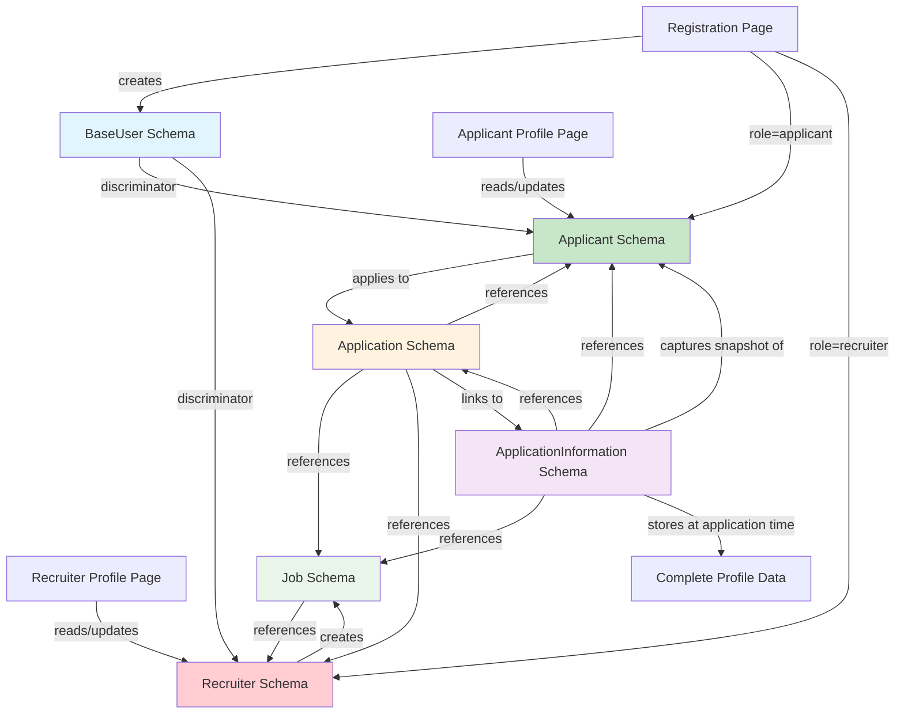

# FinAutoJobs Schema Relationships

## 🏗️ **Database Architecture Overview**

This document outlines the complete schema relationships in the FinAutoJobs system, showing how User profiles, Registration, and Job Applications are interconnected.

## 📊 **Schema Relationship Diagram**



## 🔗 **Schema Connections**

### **1. User Registration → Profile Flow**

```javascript
// Registration creates role-specific user
Registration Form → createUserByRole() → BaseUser (Applicant/Recruiter)
                ↓
Profile Page → findUserByIdAndRole() → Display user data
                ↓
Profile Update → updateUserProfile() → Update nested fields
```

### **2. Applicant → Job Application Flow**

```javascript
// When applicant applies for job
Applicant Profile → Job Application → ApplicationInformation
        ↓                    ↓                    ↓
   User Data         Application Data      Complete Snapshot
```

### **3. Data Relationships**

#### **BaseUser Schema (Parent)**
- `_id`: Primary key
- `userId`: Secondary ID for references
- `role`: 'applicant' or 'recruiter'
- Common fields: name, email, phone, etc.

#### **Applicant Schema (Child of BaseUser)**
- Inherits all BaseUser fields
- Additional fields: skills, education, experience, documents
- Links to: Applications, ApplicationInformation

#### **Recruiter Schema (Child of BaseUser)**
- Inherits all BaseUser fields  
- Additional fields: companyInfo, officeLocation, professionalLinks
- Links to: Jobs, Applications (as recruiter)

#### **Application Schema**
- `applicantId`: References BaseUser (Applicant)
- `jobId`: References Job
- `recruiterId`: References BaseUser (Recruiter)
- `applicationId`: Links to ApplicationInformation

#### **ApplicationInformation Schema**
- `applicantId`: References BaseUser (Applicant)
- `jobId`: References Job
- `applicationId`: References Application (1:1 relationship)
- Stores complete profile snapshot at application time

## 🔄 **Data Flow Examples**

### **Registration to Profile Flow**

1. **User Registration**:
   ```javascript
   POST /api/auth/register
   {
     "firstName": "John",
     "lastName": "Doe", 
     "email": "john@example.com",
     "role": "applicant",
     "skills": ["JavaScript", "React"]
   }
   ```

2. **Creates Applicant Record**:
   ```javascript
   // BaseUser fields + Applicant-specific fields
   {
     "_id": "user123",
     "userId": "user456", 
     "firstName": "John",
     "lastName": "Doe",
     "email": "john@example.com",
     "role": "applicant",
     "skills": {
       "primary": ["JavaScript", "React"],
       "technical": [],
       "soft": []
     }
   }
   ```

3. **Profile Page Access**:
   ```javascript
   GET /api/auth/profile
   // Returns complete applicant data for profile display
   ```

### **Job Application Flow**

1. **Applicant Applies for Job**:
   ```javascript
   POST /api/application-information
   {
     "jobId": "job123",
     "applicationData": {
       "expectedSalary": "8-10 LPA",
       "experience": "3 years"
     }
   }
   ```

2. **Creates Application Record**:
   ```javascript
   {
     "applicantId": "user123",
     "jobId": "job123", 
     "recruiterId": "recruiter456",
     "applicationStatus": "pending"
   }
   ```

3. **Creates ApplicationInformation Snapshot**:
   ```javascript
   {
     "applicationId": "app789",
     "applicantId": "user123",
     "jobId": "job123",
     "basicInfo": {
       "firstName": "John",
       "lastName": "Doe",
       "email": "john@example.com"
     },
     "expectedSalary": {
       "rawSalaryText": "8-10 LPA",
       "salaryRange": { "min": 800, "max": 1000 }
     },
     "skills": {
       "primary": ["JavaScript", "React"]
     }
     // Complete profile snapshot at application time
   }
   ```

## 🎯 **Key Benefits of This Architecture**

### **1. Profile Data Integrity**
- Registration data flows directly to profile pages
- Nested schema fields properly mapped
- Role-specific data handling

### **2. Application History**
- Complete profile snapshot preserved at application time
- Historical data maintained even if profile changes
- Recruiter can see exact applicant details when they applied

### **3. Flexible Data Formats**
- Salary: "10-12 LPA", "15+ LPA", "Negotiable"
- Experience: "2-3 years", "5+ years", "Fresher"
- All formats preserved in both raw and structured forms

### **4. Proper Relationships**
- One-to-many: Applicant → Applications
- One-to-many: Recruiter → Jobs
- One-to-one: Application → ApplicationInformation
- Many-to-many: Jobs ↔ Applications

## 🔧 **Implementation Status**

### ✅ **Completed**
- BaseUser, Applicant, Recruiter schemas with discriminator pattern
- Registration → Profile data flow working
- User profile updates with nested field mapping
- ApplicationInformation schema with complete snapshot capability
- API endpoints for all CRUD operations
- Validation middleware for data integrity

### 🎯 **Ready for Testing**
- Register as applicant → Profile displays registration data
- Apply for job → ApplicationInformation captures complete snapshot
- Profile updates → Changes reflected immediately
- Role-based access control working

## 📋 **Testing Checklist**

- [ ] Register applicant → Check profile page shows registration data
- [ ] Update applicant profile → Verify changes persist
- [ ] Register recruiter → Check company info displays correctly  
- [ ] Create job posting → Verify recruiter association
- [ ] Apply for job → Check ApplicationInformation creation
- [ ] View application → Verify complete profile snapshot stored

## 🚀 **Next Steps**

1. **Frontend Integration**: Connect registration/profile forms to backend APIs
2. **Application UI**: Build job application interface using ApplicationInformation
3. **Dashboard Enhancement**: Display applications with complete applicant snapshots
4. **Real-time Updates**: Implement live updates when applications are submitted

---

*This architecture ensures complete data integrity from registration through job applications while maintaining flexibility for various data formats and user roles.*
