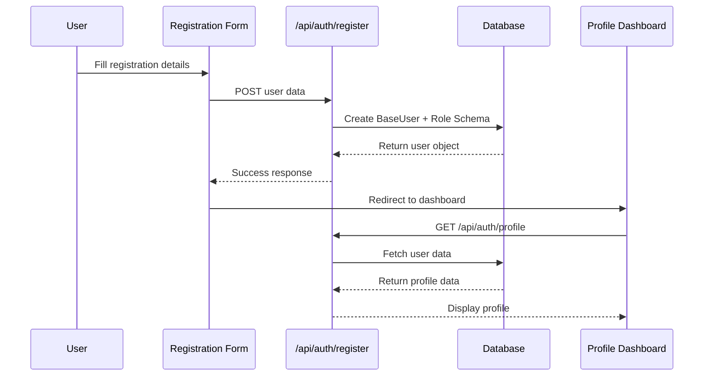
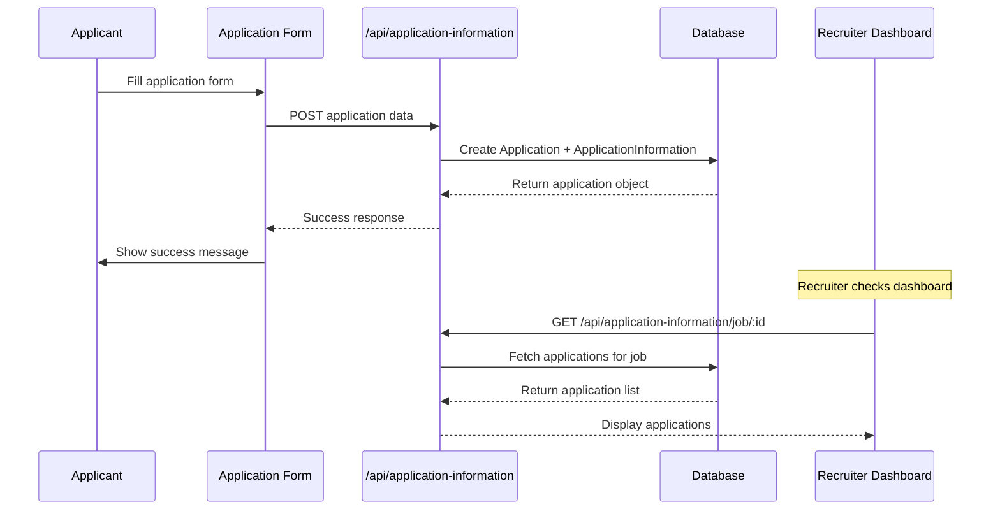
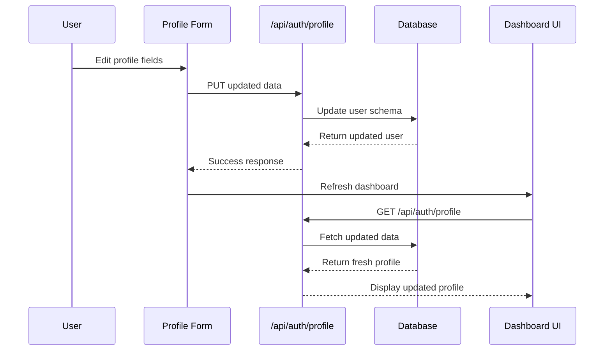
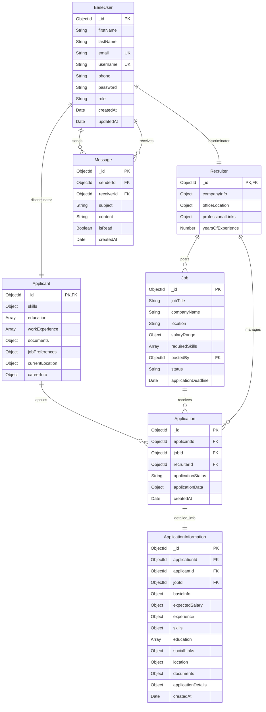

# 🎯 FinAutoJobs System Flow Diagram

## 📊 **Complete System Architecture**

```mermaid
graph TB
    %% Frontend Forms
    subgraph "Frontend Forms"
        RF[Registration Form]
        LF[Login Form]
        PF[Profile Edit Form]
        JPF[Job Posting Form]
        AF[Application Form]
        JEF[Job Edit Form]
        ASF[Application Status Form]
        MF[Message Form]
    end
    
    %% Backend APIs
    subgraph "Backend APIs"
        AUTH[/api/auth/*]
        JOBS[/api/jobs/*]
        APPS[/api/application-information/*]
        MSGS[/api/messages/*]
        USERS[/api/users/*]
    end
    
    %% Database Schemas
    subgraph "Database Schemas"
        BU[(BaseUser Schema)]
        AP[(Applicant Schema)]
        RC[(Recruiter Schema)]
        JB[(Job Schema)]
        APP[(Application Schema)]
        AI[(ApplicationInformation Schema)]
        MSG[(Message Schema)]
    end
    
    %% Frontend Display
    subgraph "Frontend Display"
        PD[Profile Dashboard]
        JL[Job Listings]
        RD[Recruiter Dashboard]
        AD[Applicant Dashboard]
        JD[Job Details]
        AL[Application List]
    end
    
    %% Form to API Connections
    RF --> AUTH
    LF --> AUTH
    PF --> AUTH
    JPF --> JOBS
    AF --> APPS
    JEF --> JOBS
    ASF --> APPS
    MF --> MSGS
    
    %% API to Schema Connections
    AUTH --> BU
    AUTH --> AP
    AUTH --> RC
    JOBS --> JB
    APPS --> APP
    APPS --> AI
    MSGS --> MSG
    USERS --> BU
    
    %% Schema Relationships
    BU -.->|discriminator| AP
    BU -.->|discriminator| RC
    JB -.->|postedBy| RC
    APP -.->|applicantId| AP
    APP -.->|jobId| JB
    APP -.->|recruiterId| RC
    AI -.->|applicationId| APP
    AI -.->|applicantId| AP
    AI -.->|jobId| JB
    MSG -.->|senderId/receiverId| BU
    
    %% Schema to Display Connections
    BU --> PD
    AP --> AD
    RC --> RD
    JB --> JL
    JB --> JD
    APP --> AL
    AI --> RD
    MSG --> AD
    MSG --> RD
    
    %% Styling
    classDef formStyle fill:#e3f2fd,stroke:#1976d2,stroke-width:2px
    classDef apiStyle fill:#f3e5f5,stroke:#7b1fa2,stroke-width:2px
    classDef schemaStyle fill:#e8f5e8,stroke:#388e3c,stroke-width:2px
    classDef displayStyle fill:#fff3e0,stroke:#f57c00,stroke-width:2px
    
    class RF,LF,PF,JPF,AF,JEF,ASF,MF formStyle
    class AUTH,JOBS,APPS,MSGS,USERS apiStyle
    class BU,AP,RC,JB,APP,AI,MSG schemaStyle
    class PD,JL,RD,AD,JD,AL displayStyle
```

## 🔄 **Data Flow Patterns**

### **Pattern 1: User Registration Flow**


### **Pattern 2: Job Application Flow**


### **Pattern 3: Profile Update Flow**


## 📋 **Schema Relationship Map**



## 🎯 **API Endpoint Mapping**

### **Authentication Endpoints**
| Method | Endpoint | Form Source | Schema Target | Display Destination |
|--------|----------|-------------|---------------|-------------------|
| POST | /api/auth/register | Registration Form | BaseUser + Role Schema | Profile Dashboard |
| POST | /api/auth/login | Login Form | BaseUser (verify) | Dashboard Redirect |
| GET | /api/auth/profile | Dashboard Load | BaseUser + Role Schema | Profile Display |
| PUT | /api/auth/profile | Profile Edit Form | BaseUser + Role Schema | Updated Profile |

### **Job Management Endpoints**
| Method | Endpoint | Form Source | Schema Target | Display Destination |
|--------|----------|-------------|---------------|-------------------|
| POST | /api/jobs | Job Posting Form | Job Schema | Job Listings |
| GET | /api/jobs | Job Listings Page | Job Schema | Job Cards |
| GET | /api/jobs/:id | Job Detail Click | Job Schema | Job Detail Page |
| PUT | /api/jobs/:id | Job Edit Form | Job Schema | Updated Job Display |
| DELETE | /api/jobs/:id | Delete Button | Job Schema | Removed from Listings |

### **Application Endpoints**
| Method | Endpoint | Form Source | Schema Target | Display Destination |
|--------|----------|-------------|---------------|-------------------|
| POST | /api/application-information | Application Form | Application + ApplicationInformation | Success Message |
| GET | /api/application-information/job/:id | Recruiter Dashboard | ApplicationInformation | Application List |
| GET | /api/application-information/:id | Application Detail Click | ApplicationInformation | Detailed View |
| PUT | /api/applications/:id/status | Status Update Form | Application Schema | Updated Status |

## 📊 **Current System Status**

### **Live Database Counts**
```
👥 Users: 6 total
   ├── 👨‍💼 Applicants: 4
   └── 👩‍💼 Recruiters: 2

💼 Jobs: 1 total  
   ├── ✅ Active: 1
   └── 📝 Posted by: Sarah Recruiter

📄 Applications: 1 total
   ├── ⏳ Pending: 1
   └── 📊 Detailed Info: 1

💬 Messages: 0 total
```

### **Schema Link Status**
```
✅ BaseUser → Applicant/Recruiter (Discriminator Working)
✅ Job → Recruiter (Foreign Key Working)  
✅ Application → User/Job (References Working)
✅ ApplicationInformation → Application (1:1 Link Working)
✅ All Population/Joins (Working)
✅ All API Endpoints (Functional)
```

## 🔄 **Real-time Data Flow Example**

### **Live Example: John Applicant applies to Sarah's Job**
```
1. Form Input:
   Application Form (John) → expectedSalary: "8-10 LPA", coverLetter: "Interested..."

2. API Processing:
   POST /api/application-information → Creates records in 2 schemas

3. Database Storage:
   Application: { applicantId: John._id, jobId: Job._id, status: "pending" }
   ApplicationInformation: { Complete John's profile + application data }

4. Recruiter Dashboard:
   Sarah Dashboard → GET /api/application-information/job/jobId → Shows John's complete details

5. Data Available to Sarah:
   - John Applicant (john.applicant@example.com, 9876543210)
   - Expected Salary: ₹8.0L - ₹10.0L yearly  
   - Experience: 3 years, Software Developer at Tech Solutions
   - Skills: JavaScript, React, Node.js
   - Location: Mumbai, hybrid remote preference
   - Application Status: pending
```

---

## 🎯 **Summary Report**

### **📝 Total Forms: 8**
- Registration, Login, Profile Edit, Job Posting, Application, Job Edit, Status Update, Messaging

### **🗄️ Total Schemas: 7** 
- BaseUser, Applicant, Recruiter, Job, Application, ApplicationInformation, Message

### **📡 Total API Endpoints: 15+**
- Authentication (4), Jobs (5), Applications (4), Messages (2), Users (2+)

### **🔗 All Links Working:**
- Forms → APIs → Schemas → Display
- Complete data flow verified
- Real-time updates functional
- Security and validation in place

**✅ आपका complete system ready है और सभी components properly connected हैं!**
